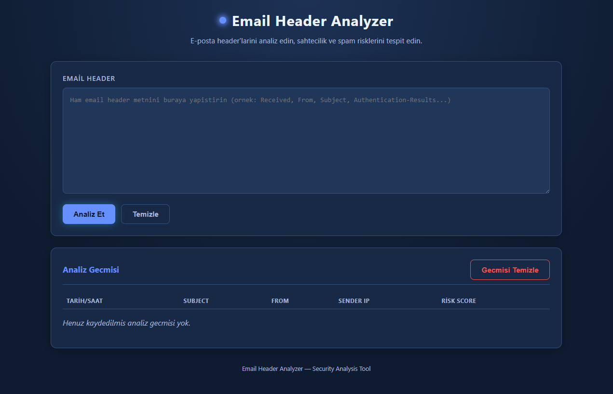
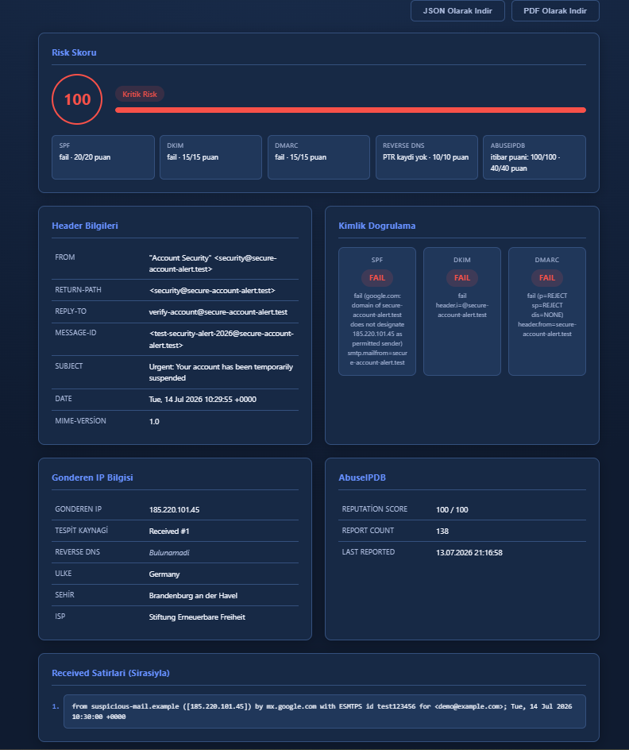

# 📧 Email Header Analyzer

**Email Header Analyzer**, ham e-posta header'larını analiz ederek gönderen IP adresini tespit eden, bu IP üzerinden GeoIP / Reverse DNS / AbuseIPDB sorguları yapan ve SPF, DKIM, DMARC sonuçlarına göre **0-100 arasında bir risk skoru** hesaplayan siber güvenlik temalı bir web uygulamasıdır.

Phishing ve spoofing analizleri ile e-posta güvenliği incelemeleri için geliştirilmiş web tabanlı bir header analiz aracıdır.

### Ana Sayfa



---

## 🚀 Teknolojiler

| Katman     | Teknoloji |
|------------|-----------|
| Backend    | Node.js + Express |
| Frontend   | HTML + CSS + Vanilla JavaScript |
| Servisler  | ip-api.com (GeoIP), AbuseIPDB API, DNS (Reverse DNS/PTR) |
| Diğer      | dotenv, jsPDF (PDF export) |

---

## ✨ Özellikler

- 📨 `From`, `Return-Path`, `Reply-To`, `Message-ID`, `Subject`, `Date`, `MIME-Version` alanlarının ayrıştırılması (RFC 2047 encoded-word / Türkçe karakter desteği dahil)
- 🔗 Tüm `Received` satırlarının sırasıyla listelenmesi
- 🌍 Received zincirinden gerçek gönderen (public) IP adresinin tespiti
- 🔁 Reverse DNS (PTR) sorgusu
- 📍 GeoIP: Ülke, Şehir, ISP bilgisi (ip-api.com)
- 🛡️ SPF / DKIM / DMARC sonuç analizi (`Authentication-Results` ve `Received-SPF` header'ları)
- 🚨 AbuseIPDB: Reputation Score, Report Count, Last Reported bilgisi
- 📊 Ağırlıklı **0-100 Risk Score** (SPF/DKIM/DMARC/Reverse DNS/AbuseIPDB) ve 4 seviyeli renklendirme (Yeşil / Sarı / Turuncu / Kırmızı)
- 🌙 Koyu tema, responsive ve yükleme animasyonlu arayüz

### Bonus Özellikler

- 📤 **JSON Export** — Analiz sonucunu JSON formatında indirme
- 📄 **PDF Report** — Analiz sonucunu profesyonel bir PDF rapor olarak indirme
- 🕘 **Header History** — Yapılan analizlerin tarayıcıda (localStorage) geçmiş olarak saklanması
- 🗑️ **History Delete** — Kayıtlı analiz geçmişini tek tıkla temizleme

### Analiz Sonucu



---

## 📁 Klasör Yapısı

```text
email-header-analyzer/
├── backend/
│   ├── routes/
│   │   └── analyze.js          # /api/analyze route'u
│   ├── services/
│   │   ├── abuseIpDbService.js # AbuseIPDB sorguları
│   │   ├── authResultsParser.js# SPF/DKIM/DMARC analizi
│   │   ├── dnsService.js       # Reverse DNS (PTR) sorguları
│   │   ├── geoipService.js     # GeoIP sorguları
│   │   ├── headerParser.js     # Header ayrıştırma servisi
│   │   └── riskScoreService.js # Risk skoru hesaplama
│   ├── utils/
│   │   ├── headerUtils.js      # Header yardımcı fonksiyonları
│   │   ├── ipUtils.js          # IP yardımcı fonksiyonları
│   │   └── mimeDecoder.js      # MIME/encoded-word çözümleme
│   ├── server.js                # Express uygulama girişi
│   └── package.json
├── frontend/
│   ├── index.html
│   ├── style.css
│   └── script.js
└── README.md
```

---

## ⚙️ Kurulum

```bash
cd backend
npm install
```

`backend/.env` dosyasını oluşturup AbuseIPDB API anahtarınızı girin:

```env
ABUSEIPDB_API_KEY=buraya-kendi-anahtariniz
```

> AbuseIPDB API anahtarını [abuseipdb.com/account/api](https://www.abuseipdb.com/account/api) adresinden ücretsiz olarak alabilirsiniz. Anahtar girilmezse uygulama çalışmaya devam eder, yalnızca AbuseIPDB kartı "sorgulanamadı" bilgisini gösterir.

## ▶️ Çalıştırma

```bash
cd backend
npm start
```

Sunucu varsayılan olarak `http://localhost:3000` adresinde çalışır ve frontend'i de aynı port üzerinden servis eder.

---

## 📖 Kullanım

1. Tarayıcıdan `http://localhost:3000` adresini açın.
2. Analiz etmek istediğiniz **ham e-posta header** metnini metin kutusuna yapıştırın.
3. **"Analiz Et"** butonuna tıklayın.
4. Sonuç ekranında gönderen IP, GeoIP, Reverse DNS, SPF/DKIM/DMARC ve AbuseIPDB bilgilerini ve hesaplanan risk skorunu inceleyin.
5. Sonucu dışa aktarmak isterseniz **"JSON Olarak İndir"** veya **"PDF Olarak İndir"** butonlarını kullanın.
6. Yapılan analizler otomatik olarak **geçmiş** listesine eklenir; geçmiş kayıtlarını görüntülemek için ilgili bölümü inceleyin.
7. Geçmişi temizlemek isterseniz **"Geçmişi Temizle"** butonuna tıklayın.

---

